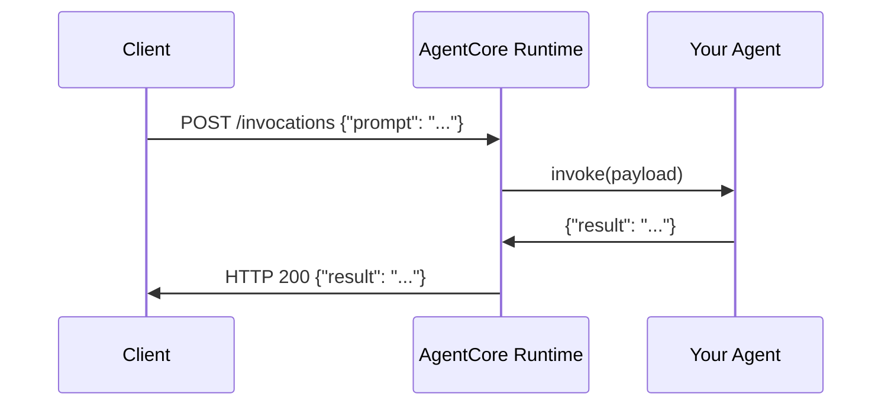

Building an agent locally is straightforward: write a function, call it, print the result. Deploying it to production is harder — you need a server, request handling, health checks, error formatting, and a stable interface for other systems to call. AWS Bedrock AgentCore handles all of that for you. By wrapping your agent with the `BedrockAgentCoreApp` SDK, you get a managed HTTP runtime without touching your core agent logic.

<Columns cols={3}>
  <Card title="Separation of concerns" icon="split">
    Agent logic stays in plain Python. AgentCore owns the HTTP layer, routing, and monitoring.
  </Card>
  <Card title="Standardized interface" icon="plug">
    Every agent exposes the same `/invocations` and `/ping` endpoints, making integration predictable.
  </Card>
  <Card title="Production foundation" icon="rocket">
    Add tools, logging, and access control later without rewriting the agent or its runtime wiring.
  </Card>
</Columns>

## How AgentCore works

AgentCore acts as a control tower between incoming HTTP requests and your agent function. It does not change what your agent does — it changes how the outside world reaches it.



The runtime server starts on port `8080` by default and exposes two endpoints:

| Endpoint | Method | Purpose |
|----------|--------|---------|
| `/invocations` | POST | Send requests to your agent |
| `/ping` | GET | Health check |

## Prerequisites and installation

AgentCore requires Python 3.10 or higher. Install the SDK and supporting libraries:

```bash
pip install bedrock-agentcore python-dotenv requests openai
```

Store your OpenAI API key in a `.env` file in your working directory:

```bash .env
OPENAI_API_KEY=your-key-here
```

## Step 1: Build the base agent

Write your agent as a plain Python function. Keep it free of any AgentCore-specific logic — this makes it easy to test in isolation and swap out later.

```python agent.py
import openai

def process_message(message: str) -> str:
    """Process a message and return a response using OpenAI."""
    client = openai.OpenAI()
    response = client.chat.completions.create(
        model="gpt-4o-mini",
        messages=[{"role": "user", "content": message}],
        temperature=0
    )
    return response.choices[0].message.content
```

Test it locally before adding the runtime:

```python
result = process_message("What is AI?")
print(result)
```

<Tip>
Confirm the agent works correctly in isolation before wrapping it. This makes it easier to distinguish agent bugs from runtime-integration issues later.
</Tip>

## Step 2: Create the AgentCore application

`BedrockAgentCoreApp` sets up all the HTTP infrastructure in a single line:

```python agent.py
from bedrock_agentcore.runtime import BedrockAgentCoreApp

app = BedrockAgentCoreApp()
```

## Step 3: Register your agent as the entrypoint

The `@app.entrypoint` decorator connects your function to the runtime. AgentCore calls this function for every incoming `POST /invocations` request and passes the request body as a `payload` dictionary.

By convention, the user's message arrives in the `prompt` field:

```python agent.py
@app.entrypoint
def invoke(payload: dict) -> dict:
    """
    Process user input and return a response.
    AgentCore calls this function for each HTTP request to /invocations.
    """
    user_message = payload.get("prompt", "Hello")
    result = process_message(user_message)
    return {"result": result}
```

<Note>
Your core `process_message` function remains completely unchanged. The entrypoint is a thin adapter that reads the payload and formats the response.
</Note>

## Step 4: Start the runtime server

Call `app.run()` to start the HTTP server. In production, save the complete agent to a file and run it as a standalone script:

```python agent.py
import os
import openai
from bedrock_agentcore.runtime import BedrockAgentCoreApp
from dotenv import load_dotenv

load_dotenv()

app = BedrockAgentCoreApp()

def process_message(message: str) -> str:
    client = openai.OpenAI()
    response = client.chat.completions.create(
        model="gpt-4o-mini",
        messages=[{"role": "user", "content": message}],
        temperature=0
    )
    return response.choices[0].message.content

@app.entrypoint
def invoke(payload: dict) -> dict:
    user_message = payload.get("prompt", "Hello")
    result = process_message(user_message)
    return {"result": result}

if __name__ == "__main__":
    app.run()  # Server starts on http://localhost:8080
```

Run the server:

```bash
python agent.py
```

<Warning>
Calling `app.run()` blocks the process. In a Jupyter notebook, save the code to a `.py` file and run it in a separate terminal.
</Warning>

## Step 5: Send requests to your agent

Once the server is running, interact with it over HTTP. The request goes to `/invocations` with a JSON body containing a `prompt` field.

<Tabs>
  <Tab title="curl">
    ```bash
    curl -X POST http://localhost:8080/invocations \
      -H 'Content-Type: application/json' \
      -d '{"prompt": "What is AI?"}'
    ```
  </Tab>
  <Tab title="Python">
    ```python
    import requests

    response = requests.post(
        "http://localhost:8080/invocations",
        json={"prompt": "What is AI?"}
    )
    result = response.json()
    print(result)
    ```
  </Tab>
</Tabs>

Expected response structure:

```json
{
  "result": "AI (Artificial Intelligence) refers to computer systems that can perform tasks typically requiring human intelligence..."
}
```

## Before and after AgentCore

The table below shows what changes and what stays the same when you adopt AgentCore:

| Concern | Before AgentCore | After AgentCore |
|---------|-----------------|-----------------|
| Agent logic | `process_message(msg)` | Unchanged |
| Calling the agent | Direct Python function call | HTTP POST to `/invocations` |
| Health checks | Manual | Built-in `/ping` endpoint |
| Request tracking | None | Automatic |
| Error formatting | Ad hoc | Structured HTTP responses |

```python
# Before: direct function call
result = process_message("What is AI?")
print(result)

# After: HTTP request to the managed runtime
response = requests.post(
    "http://localhost:8080/invocations",
    json={"prompt": "What is AI?"}
)
result = response.json()
```

## What to add next

Once your agent runs through the AgentCore runtime, you can extend it without modifying the core logic:

<Columns cols={2}>
  <Card title="Add tools" icon="wrench">
    Give your agent the ability to search the web, query databases, or call external APIs.
  </Card>
  <Card title="Enable logging" icon="file-text">
    Capture every request and response for debugging and compliance.
  </Card>
  <Card title="Access control" icon="shield">
    Restrict which callers can invoke specific agent capabilities.
  </Card>
  <Card title="Deploy to AWS" icon="cloud">
    Use the AgentCore starter toolkit to move from localhost to production AWS infrastructure.
  </Card>
</Columns>
