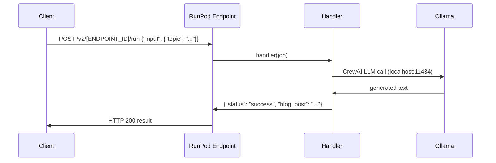

RunPod is a GPU-optimised cloud platform that lets you deploy containerised AI agents as serverless endpoints. Instead of provisioning servers or configuring load balancers, you package your agent into a Docker image, push it to RunPod, and the platform handles scaling, container lifecycle, and resource allocation automatically. You only pay for the compute time your agent actually uses.

<Columns cols={2}>
  <Card title="Automatic scaling" icon="chart-line">
    Containers spin up and down based on request volume. RunPod pre-warms workers so your endpoint is always ready.
  </Card>
  <Card title="Cost efficiency" icon="circle-dollar-sign">
    Pay only for active compute time. Idle workers do not incur charges.
  </Card>
  <Card title="Zero infrastructure management" icon="server">
    No servers to configure, no load balancers to set up. RunPod manages all of it.
  </Card>
  <Card title="GPU-ready base images" icon="microchip">
    Start from a RunPod PyTorch image with CUDA already installed, then add your application on top.
  </Card>
</Columns>

## How serverless endpoints work

RunPod executes a Python handler function whenever your endpoint receives a request. You bind the function using the `runpod` SDK, and RunPod calls it with a JSON payload for every incoming job.



The handler receives every job as a dictionary with an `"input"` key containing the caller's payload.

## Prerequisites

- A [RunPod account](https://get.runpod.io)
- Docker installed locally
- A Docker Hub account (or another container registry)

## Step 1: Define the handler

Create `handler.py`. The handler function reads the job input, runs your agent logic, and returns a result or error dictionary. Register it with `runpod.serverless.start`.

```python handler.py
"""RunPod handler for CrewAI blog generation."""

import runpod
from crewai import Agent, Task, Crew, LLM
from crewai.tools import tool

# Configure Ollama LLM — loaded once at container startup
llm = LLM(model="ollama/openhermes", base_url="http://localhost:11434")

@tool("Research Tool")
def fake_research(topic: str) -> str:
    """Pretends to search for information about a topic."""
    return f"Key facts about {topic}: adoption is growing, costs are falling, and expert interest is high."

blog_writer = Agent(
    role="Blog Writer",
    goal="Write engaging and informative blog posts on various topics",
    backstory="You are a professional blog writer known for well-researched, clear articles.",
    tools=[fake_research],
    verbose=True,
    llm=llm
)

def create_blog_post(topic):
    """Creates a blog post on the given topic using CrewAI."""
    blog_task = Task(
        description=f"""
        Write a blog post about {topic}.
        Your blog should have an attention-grabbing title, a brief introduction,
        3-4 main points supported by research, and a conclusion.
        Use the Research Tool to gather facts about {topic}.
        """,
        expected_output="A well-structured blog post of approximately 500 words",
        agent=blog_writer
    )
    crew = Crew(agents=[blog_writer], tasks=[blog_task], verbose=True, llm=llm)
    result = crew.kickoff()
    return result.raw

def handler(job):
    """Handler function that will be used to process jobs."""
    job_input = job["input"]
    topic = job_input.get("topic", "technology")

    try:
        blog_post = create_blog_post(topic)
        return {"status": "success", "blog_post": blog_post}
    except Exception as e:
        return {"status": "error", "message": str(e)}


runpod.serverless.start({"handler": handler})
```

<Note>
Initialise the LLM and agent at module level, outside the handler function. RunPod reuses the same container process across requests, so global setup runs only once and speeds up subsequent calls.
</Note>

## Step 2: Write the Dockerfile

The Dockerfile builds the complete runtime — base image, Python dependencies, Ollama, and the model weights — into a single portable image. Baking the model into the image means RunPod does not need to download it when a new container starts, which reduces cold-start latency.

<Tabs>
  <Tab title="Full Dockerfile">
    ```dockerfile Dockerfile
    FROM runpod/pytorch:2.0.1-py3.10-cuda11.8.0-devel-ubuntu22.04

    ENV PYTHONUNBUFFERED=1

    # Install system dependencies
    RUN apt-get update --yes --quiet && \
        DEBIAN_FRONTEND=noninteractive apt-get install --yes --quiet --no-install-recommends \
        software-properties-common gpg-agent build-essential \
        apt-utils ca-certificates curl && \
        add-apt-repository --yes ppa:deadsnakes/ppa && \
        apt-get update --yes --quiet && \
        DEBIAN_FRONTEND=noninteractive apt-get install --yes --quiet --no-install-recommends \
        python3.11 python3.11-venv python3.11-dev

    # Create and activate a Python virtual environment
    RUN python3.11 -m venv /app/venv
    ENV PATH="/app/venv/bin:$PATH"

    RUN ln -sf $(which python3.11) /usr/local/bin/python && \
        ln -sf $(which python3.11) /usr/local/bin/python3

    # Install Python dependencies
    COPY requirements.txt /requirements.txt
    RUN pip install --upgrade pip && \
        pip install uv && \
        uv pip install --upgrade -r /requirements.txt --no-cache-dir && \
        uv pip install "langchain-community>=0.0.34" --no-cache-dir

    # Install Ollama
    RUN curl -fsSL https://ollama.com/install.sh | sh

    # Download model during build — baked into the image for faster cold starts
    RUN ollama serve > /dev/null 2>&1 & \
        sleep 25 && \
        ollama pull openhermes && \
        sleep 10 && \
        pkill ollama

    # Add application files
    ADD handler.py .
    ADD start.sh /start.sh
    RUN chmod +x /start.sh

    CMD ["/start.sh"]
    ```
  </Tab>
  <Tab title="requirements.txt">
    ```text requirements.txt
    crewai>=0.12
    crewai-tools>=0.1
    runpod~=1.7.9
    ```
  </Tab>
  <Tab title="start.sh">
    ```bash start.sh
    #!/bin/bash
    set -e

    start_ollama() {
        echo "Starting Ollama service..."
        nohup ollama serve > /ollama.log 2>&1 &

        echo "Waiting for Ollama to initialize..."
        until curl -s http://localhost:11434/api/version >/dev/null; do
            sleep 1
        done

        echo "Loading openhermes model..."
        ollama run openhermes > /openhermes.log 2>&1 &

        sleep 3
        echo "Available models:"
        ollama list
    }

    start_ollama

    echo "Starting serverless handler..."
    python handler.py

    sleep infinity
    ```
  </Tab>
</Tabs>

<Tip>
RunPod provides a range of pre-built base images. `runpod/pytorch:2.0.1-py3.10-cuda11.8.0-devel-ubuntu22.04` ships with CUDA, cuDNN, and common ML libraries already installed, giving you a solid starting point without extra setup.
</Tip>

## Step 3: Build and push the image

Build the image for the `linux/amd64` platform (required by RunPod's infrastructure) and push it to Docker Hub in one command:

```bash
docker build -t your-dockerhub-username/agents:1.0 . --push --platform linux/amd64
```

## Step 4: Deploy to RunPod

<Steps>
  <Step title="Open the Serverless tab">
    Log in to RunPod and navigate to **Serverless** in the left sidebar. Click **New Endpoint**.
  </Step>
  <Step title="Select your image source">
    Choose **Docker Image** and enter your image name, for example `your-dockerhub-username/agents:1.0`.

    Alternatively, connect a **GitHub repo** and RunPod will build and deploy new commits automatically.
  </Step>
  <Step title="Select GPU hardware">
    RunPod presents a prioritised list of GPU types. Select multiple GPU tiers — RunPod rotates through them based on availability to minimise wait times.
  </Step>
  <Step title="Configure workers">
    Set the minimum and maximum number of workers. Workers in an `idle` state do not incur charges — you only pay for active compute during job execution.

    <Note>
      RunPod may allocate a few extra workers beyond your maximum to ensure your `max workers` count remains available even when some are handling requests.
    </Note>
  </Step>
  <Step title="Enable FlashBoot (optional)">
    For high-traffic endpoints, enable **FlashBoot** to reduce cold-start times. FlashBoot caches container state so workers initialise significantly faster on scale-out.
  </Step>
</Steps>

## Step 5: Test your endpoint

Once deployed, RunPod displays your endpoint ID in the dashboard. Send a request using the built-in test UI or programmatically.

<Tabs>
  <Tab title="curl">
    ```bash
    curl --request POST \
         --url https://api.runpod.ai/v2/[ENDPOINT_ID]/run \
         --header "accept: application/json" \
         --header "authorization: [YOUR_API_KEY]" \
         --header "content-type: application/json" \
         --data '{
           "input": {
             "topic": "Technology"
           }
         }'
    ```
  </Tab>
  <Tab title="Python">
    ```python
    import requests

    response = requests.post(
        "https://api.runpod.ai/v2/[ENDPOINT_ID]/run",
        headers={
            "accept": "application/json",
            "authorization": "[YOUR_API_KEY]",
            "content-type": "application/json"
        },
        json={"input": {"topic": "Technology"}}
    )
    print(response.json())
    ```
  </Tab>
</Tabs>

Expected response:

```json
{
  "status": "success",
  "blog_post": "..."
}
```

<Warning>
Generate and store your RunPod API key securely. Do not embed it directly in source code — use environment variables or a secrets manager.
</Warning>

## Update your deployment

<Columns cols={2}>
  <Card title="Docker image update" icon="box">
    Push a new image tag. In the RunPod dashboard, update the endpoint to point to the new tag. RunPod performs a rolling update, swapping workers to the new image without downtime.
  </Card>
  <Card title="GitHub integration" icon="github">
    Connect your repository to RunPod. Every new commit triggers an automatic build and rolling deployment — no manual steps required.
  </Card>
</Columns>

## Next steps

<Columns cols={2}>
  <Card title="Run LLMs locally with Ollama" icon="server" href="/deployment/on-prem-ollama">
    Learn how Ollama works before packaging it for RunPod — pull models, call the REST API, and integrate with LangChain.
  </Card>
  <Card title="Containerize with Docker" icon="box" href="/deployment/docker">
    Deepen your understanding of Dockerfiles, layer caching, and environment variable injection before deploying to the cloud.
  </Card>
</Columns>
