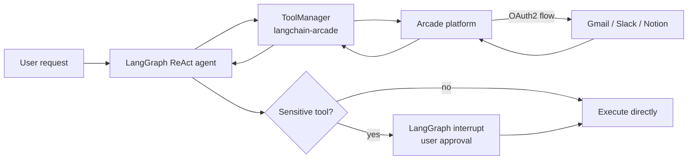

Production agents face a challenge that local demos never surface: how do you authenticate dozens of users against Gmail, Slack, or Notion without handing out shared credentials or building OAuth flows from scratch? Arcade.dev solves this by acting as a unified authentication and execution layer between your LangGraph agent and every external service it calls. This tutorial walks through building a multi-user agent system—from a basic conversational agent to a full production setup with human-in-the-loop (HITL) approval for sensitive write operations.

<CardGroup cols={3}>
  <Card title="OAuth2 handled for you" icon="lock">
    Arcade manages the full authorization code flow for each user, per provider.
  </Card>
  <Card title="User isolation built in" icon="users">
    Token storage and scoped execution are tied to a `user_id`, not a shared secret.
  </Card>
  <Card title="HITL approval workflow" icon="shield-check">
    Wrap any tool with an interrupt gate so users approve writes before they execute.
  </Card>
</CardGroup>

## Prerequisites

Install the required packages before running any of the cells below.

```bash
pip install langgraph langchain-arcade "langchain[openai]"
```

You need two API keys: one from OpenAI and one from Arcade.

```python
import getpass
import os

def _set_env(key: str, default: str | None = None):
    if key not in os.environ:
        if default:
            os.environ[key] = default
        else:
            os.environ[key] = getpass.getpass(f"{key}:")

_set_env("OPENAI_API_KEY")
_set_env("ARCADE_API_KEY")
_set_env("ARCADE_USER_ID")  # must match the email used to create the Arcade account
```

<Note>
`ARCADE_USER_ID` is the email address tied to your Arcade account. Arcade uses it to store and scope each user's OAuth tokens, so every user in a multi-user deployment passes their own identifier at runtime.
</Note>

## Architecture overview

A single-user agent that reads your own Gmail is straightforward. Scaling that to many users requires separating concerns:



Arcade sits between your agent and external APIs. It stores OAuth refresh tokens per `user_id`, checks whether the current user has already authorized a provider, and returns an authorization URL when they haven't.

## Build a basic conversational agent

Start with a no-tools agent to establish the LangGraph pattern you'll extend throughout this tutorial.

```python
from langgraph.prebuilt.chat_agent_executor import create_react_agent
from langgraph.checkpoint.memory import MemorySaver
from langchain_core.messages import HumanMessage
import uuid

checkpointer = MemorySaver()

agent_a = create_react_agent(
    model="openai:gpt-4o",
    prompt=(
        "You are a helpful assistant that can help with everyday tasks."
        " If the user's request is confusing you must ask them to clarify"
        " their intent, and fulfill the instruction to the best of your"
        " ability. Be concise and friendly at all times."
    ),
    tools=[],  # no tools yet
    checkpointer=checkpointer,
)
```

Use this helper to stream responses throughout the tutorial:

```python
from langgraph.graph.state import CompiledStateGraph

def run_graph(graph: CompiledStateGraph, config, input):
    for event in graph.stream(input, config=config, stream_mode="values"):
        if "messages" in event:
            event["messages"][-1].pretty_print()
```

Each conversation thread gets a unique `thread_id`. The `MemorySaver` checkpointer keeps context across turns.

```python
config = {
    "configurable": {
        "thread_id": uuid.uuid4()
    }
}

user_message = {"messages": [HumanMessage(content="summarize my latest 3 emails please")]}
run_graph(agent_a, config, user_message)
# → The agent has no email access and says so.
```

## Add Gmail access with Arcade

<Steps>
  <Step title="Initialize the Arcade client and ToolManager">
    ```python
    from langchain_arcade import ToolManager
    from arcadepy import Arcade

    arcade_client = Arcade(api_key=os.getenv("ARCADE_API_KEY"))
    manager = ToolManager(client=arcade_client)
    ```
  </Step>

  <Step title="Load the Gmail tool">
    ```python
    gmail_tool = manager.init_tools(tools=["Gmail_ListEmails"])[0]
    ```
  </Step>

  <Step title="Authorize the user">
    Arcade checks whether the current user already granted access. If not, it returns an OAuth URL.

    ```python
    def authorize_tool(tool_name, user_id, manager):
        auth_response = manager.authorize(
            tool_name=tool_name,
            user_id=user_id
        )
        if auth_response.status != "completed":
            print(
                f"The app wants to use the {tool_name} tool.\n"
                f"Please click this url to authorize it {auth_response.url}"
            )
            manager.wait_for_auth(auth_response.id)

    authorize_tool(gmail_tool.name, os.getenv("ARCADE_USER_ID"), manager)
    ```

    Once the user clicks the URL and grants access, the function returns and the token is stored in Arcade's vault for future calls.
  </Step>

  <Step title="Create an agent with Gmail capabilities">
    Pass `user_id` in the LangGraph config so Arcade can look up the correct token at execution time.

    ```python
    agent_b = create_react_agent(
        model="openai:gpt-4o",
        prompt=(
            "You are a helpful assistant that can help with everyday tasks."
            " If the user's request is confusing you must ask them to clarify"
            " their intent, and fulfill the instruction to the best of your"
            " ability. Be concise and friendly at all times."
            " Use the Gmail tools that you have to address requests about emails."
        ),
        tools=[gmail_tool],
        checkpointer=checkpointer,
    )

    config = {
        "configurable": {
            "thread_id": uuid.uuid4(),
            "user_id": os.getenv("ARCADE_USER_ID"),
        }
    }

    user_message = {"messages": [HumanMessage(content="summarize my latest 3 emails please")]}
    run_graph(agent_b, config, user_message)
    ```
  </Step>
</Steps>

## Extend to multiple services

Once you add multiple tools across different OAuth providers, you want to batch the authorization flows so the user only clicks once per provider.

```python
def authorize_tools(tools, user_id, client):
    # Group scopes by provider so each provider gets one auth URL
    provider_to_scopes = {}
    for tool in tools:
        provider = tool.requirements.authorization.provider_id
        if provider not in provider_to_scopes:
            provider_to_scopes[provider] = set()

        if tool.requirements.authorization.oauth2.scopes:
            provider_to_scopes[provider] |= set(
                tool.requirements.authorization.oauth2.scopes
            )

    for provider, scopes in provider_to_scopes.items():
        auth_response = client.auth.start(
            user_id=user_id,
            scopes=list(scopes),
            provider=provider,
        )

        if auth_response.status != "completed":
            print(f"Please click here to authorize: {auth_response.url}")
            print("Waiting for authorization completion...")
            client.auth.wait_for_completion(auth_response)
```

Register Gmail send, Slack, and Notion as a batch:

```python
manager.add_tool("Gmail.SendEmail")
manager.add_toolkit("Slack")
manager.add_toolkit("NotionToolkit")

authorize_tools(
    tools=manager.definitions,
    user_id=os.getenv("ARCADE_USER_ID"),
    client=arcade_client,
)
```

Build the multi-service agent using `manager.to_langchain()` to get all tools in LangChain format:

```python
agent_c = create_react_agent(
    model="openai:gpt-4o",
    prompt=(
        "You are a helpful assistant that can help with everyday tasks."
        " If the user's request is confusing you must ask them to clarify"
        " their intent, and fulfill the instruction to the best of your"
        " ability. Be concise and friendly at all times."
        " Use the Gmail tools to address requests about reading or sending emails."
        " Use the Slack tools to address requests about interactions with users and channels in Slack."
        " Use the Notion tools to address requests about managing content in Notion Pages."
        " In general, when possible, use the most relevant tool for the job."
    ),
    tools=manager.to_langchain(),
    checkpointer=checkpointer,
)
```

## Add human-in-the-loop approval for sensitive operations

Some tools—sending emails, posting to Slack, creating Notion pages—have real-world consequences. Wrap them with a HITL gate using LangGraph's `interrupt` mechanism.

### Identify sensitive tools

```python
tools_to_protect = [
    "Gmail_SendEmail",
    "Slack_SendDmToUser",
    "Slack_SendMessage",
    "Slack_SendMessageToChannel",
    "NotionToolkit_AppendContentToEndOfPage",
    "NotionToolkit_CreatePage",
]
```

### Create the interrupt wrapper

```python
from typing import Callable, Any
from langchain_core.tools import tool, BaseTool
from langgraph.types import interrupt, Command
from langchain_core.runnables import RunnableConfig
import pprint


def add_human_in_the_loop(target_tool: Callable | BaseTool) -> BaseTool:
    """Wrap a tool to require human approval before execution."""
    if not isinstance(target_tool, BaseTool):
        target_tool = tool(target_tool)

    @tool(
        target_tool.name,
        description=target_tool.description,
        args_schema=target_tool.args_schema,
    )
    def call_tool_with_interrupt(config: RunnableConfig, **tool_input):
        arguments = pprint.pformat(tool_input, indent=4)
        response = interrupt(
            f"Do you allow the call to {target_tool.name} with arguments:\n"
            f"{arguments}"
        )

        if response == "yes":
            return target_tool.invoke(tool_input, config)
        elif response == "no":
            return "The User did not allow the tool to run"
        else:
            raise ValueError(f"Unsupported interrupt response type: {response}")

    return call_tool_with_interrupt
```

### Apply the wrapper selectively

Read-only tools execute without interruption; write tools pause for approval.

```python
protected_tools = [
    add_human_in_the_loop(t) if t.name in tools_to_protect else t
    for t in manager.to_langchain()
]
```

### Build the production agent

```python
agent_hitl = create_react_agent(
    model="openai:gpt-4o",
    prompt=(
        "You are a helpful assistant that can help with everyday tasks."
        " If the user's request is confusing you must ask them to clarify"
        " their intent, and fulfill the instruction to the best of your"
        " ability. Be concise and friendly at all times."
        " Use the Gmail tools to address requests about reading or sending emails."
        " Use the Slack tools to address requests about interactions with users and channels in Slack."
        " Use the Notion tools to address requests about managing content in Notion Pages."
        " In general, when possible, use the most relevant tool for the job."
    ),
    tools=protected_tools,
    checkpointer=checkpointer,
)
```

### Handle interrupt state

```python
def yes_no_loop(prompt: str) -> str:
    print(prompt)
    user_input = input("Your response [y/n]: ")
    while user_input.lower() not in ["y", "n"]:
        user_input = input("Your response (must be 'y' or 'n'): ")
    return "yes" if user_input.lower() == "y" else "no"


def handle_interrupts(graph: CompiledStateGraph, config):
    for interr in graph.get_state(config).interrupts:
        approved = yes_no_loop(interr.value)
        run_graph(graph, config, Command(resume=approved))
```

### Run with approval

```python
config = {
    "configurable": {
        "thread_id": uuid.uuid4(),
        "user_id": os.getenv("ARCADE_USER_ID"),
    }
}

prompt = (
    'send an email with subject "confidential data" and body '
    '"this is top secret information" to random-dude@example.com'
)
user_message = {"messages": [HumanMessage(content=prompt)]}
run_graph(agent_hitl, config, user_message)

# Agent pauses here — inspect the interrupt state
print(agent_hitl.get_state(config).interrupts)

# Resume after user decision
handle_interrupts(agent_hitl, config)
```

<Warning>
If you call `handle_interrupts` and the user selects "no", the tool call is cancelled and the agent receives a message explaining that the user did not allow execution. The agent can then respond accordingly without retrying the blocked action.
</Warning>

## Full interactive loop

The complete production loop combines everything: multi-service access, OAuth per user, and HITL gating.

```python
config = {
    "configurable": {
        "thread_id": uuid.uuid4(),
        "user_id": os.getenv("ARCADE_USER_ID"),
    }
}

while True:
    user_input = input("You: ")
    if user_input.lower() == "exit":
        break

    user_message = {"messages": [HumanMessage(content=user_input)]}
    run_graph(agent_hitl, config, user_message)
    handle_interrupts(agent_hitl, config)
```

<Tip>
In a web application, replace `input()` with a WebSocket or REST endpoint. The `thread_id` becomes the session identifier, and `user_id` comes from your authentication middleware. LangGraph's checkpointer persists state between requests.
</Tip>

## What you built

<CardGroup cols={2}>
  <Card title="Single-user Gmail agent" icon="envelope">
    OAuth2 via Arcade — no token storage code required.
  </Card>
  <Card title="Multi-service agent" icon="plug">
    Gmail, Slack, and Notion authorized in a single batch flow.
  </Card>
  <Card title="HITL write protection" icon="eye">
    LangGraph interrupts pause execution pending explicit user approval.
  </Card>
  <Card title="Production-ready loop" icon="arrow-right-arrow-left">
    Per-user identity, persistent memory, and graceful interrupt handling.
  </Card>
</CardGroup>
