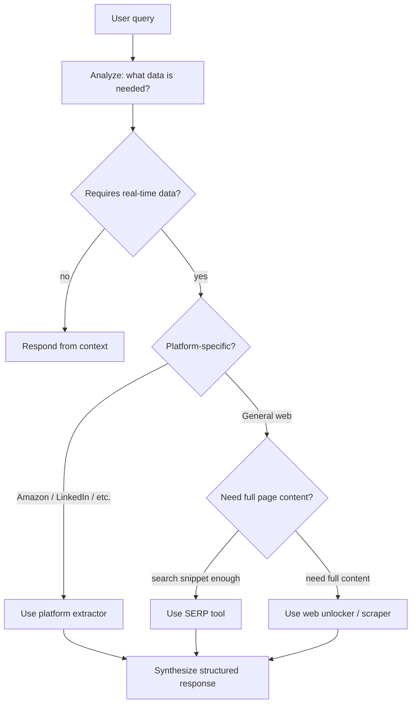

Standard HTTP requests fail against modern anti-bot systems. Rate limits, CAPTCHAs, and geo-restrictions block naive scrapers before they collect meaningful data. Bright Data's infrastructure handles all of that—its global proxy network and built-in bypass mechanisms give your agent reliable access to any public web source. This tutorial shows you two integration paths: the `langchain-brightdata` package for quick setup, and the Bright Data MCP server for access to 60+ specialized platform extractors.

<CardGroup cols={3}>
  <Card title="Global proxy network" icon="globe">
    Route requests through Bright Data's residential and datacenter IPs to avoid blocks.
  </Card>
  <Card title="CAPTCHA bypass" icon="robot">
    Bright Data's Unlocker handles bot detection automatically, including JS rendering.
  </Card>
  <Card title="Structured extraction" icon="table">
    Platform-specific parsers for Amazon, LinkedIn, and more return clean JSON.
  </Card>
</CardGroup>

## Choose your integration path

<Tabs>
  <Tab title="LangChain integration">
    The `langchain-brightdata` package provides a `BrightDataSERP` tool that slots directly into any LangChain or LangGraph agent. Use this path when you want quick setup and standard web search.

    **Best for:** search-first workflows, rapid prototyping, Google or Bing SERP data.
  </Tab>
  <Tab title="MCP server">
    The Bright Data MCP server exposes 60+ tools including platform-specific extractors for Amazon, LinkedIn, Instagram, and more, plus universal web scraping with JS rendering.

    **Best for:** structured data extraction from major platforms, advanced browser automation, production scraping pipelines.
  </Tab>
</Tabs>

## Path 1: LangChain integration

### Installation

```bash
pip install langchain-brightdata langchain-google-genai langgraph python-dotenv
```

### Configure API keys

```python
# Write to .env (replace with your actual keys)
# BRIGHT_DATA_API_TOKEN=<your-brightdata-api-key>
# GOOGLE_API_KEY=<your-google-api-key>
```

```python
from langchain_brightdata import BrightDataSERP
from langchain_google_genai import ChatGoogleGenerativeAI
from langgraph.prebuilt import create_react_agent
from dotenv import load_dotenv
import os

load_dotenv()

print(f"Bright Data API Key loaded: {'Yes' if os.getenv('BRIGHT_DATA_API_TOKEN') else 'No'}")
print(f"Google API Key loaded: {'Yes' if os.getenv('GOOGLE_API_KEY') else 'No'}")
```

### Initialize the language model

```python
llm = ChatGoogleGenerativeAI(
    model="gemini-2.0-flash",
    temperature=0.1,  # low temperature for consistent agent decisions
)
```

### Configure the SERP tool

```python
serp_tool = BrightDataSERP(
    search_engine="google",
    country="us",
    language="en",
    results_count=10,
    parse_results=True,  # convert raw HTML to structured data
)

print(f"Search Engine: {serp_tool.search_engine}")
print(f"Country: {serp_tool.country}")
print(f"Language: {serp_tool.language}")
print(f"Results Count: {serp_tool.results_count}")
```

`parse_results=True` instructs Bright Data's parser to convert raw search engine HTML into structured JSON the LLM can process directly.

### Create the ReAct agent

```python
agent = create_react_agent(
    model=llm,
    tools=[serp_tool],
    prompt=(
        "You are a web researcher agent with access to a SERP tool. "
        "You MUST use the tool to answer user queries. If no specific country, "
        "language, search engine, or vertical is specified, choose what best fits "
        "the user's question."
    ),
)
```

### Run a search query

```python
user_query = "What are the latest developments and news in AI technology in the US?"

for step in agent.stream(
    {"messages": [("human", user_query)]},
    stream_mode="values",
):
    step["messages"][-1].pretty_print()
```

The streaming output lets you observe the agent's reasoning process: query analysis, tool invocation, result processing, and final synthesis.

### Build a reusable research assistant factory

Wrap the setup logic so you can create localized agents on demand:

```python
def create_research_assistant(
    search_engine: str = "google",
    country: str = "us",
    language: str = "en",
):
    """
    Create a research agent configured for a specific locale.

    Args:
        search_engine: "google" or "bing"
        country: ISO country code for localized results
        language: ISO language code
    """
    llm = ChatGoogleGenerativeAI(model="gemini-2.0-flash", temperature=0.1)

    serp_tool = BrightDataSERP(
        search_engine=search_engine,
        country=country,
        language=language,
        results_count=15,
        parse_results=True,
    )

    agent = create_react_agent(llm, [serp_tool])

    print(f"Research Assistant created!")
    print(f"  Engine: {search_engine.title()}")
    print(f"  Location: {country.upper()}")
    print(f"  Language: {language.upper()}")

    return agent

research_assistant = create_research_assistant()
```

### Advanced configuration patterns

<CodeGroup>

```python multi-language research
spanish_serp = BrightDataSERP(
    search_engine="google",
    country="es",
    language="es",
    results_count=15,
    parse_results=True,
)

spanish_agent = create_react_agent(llm, [spanish_serp])
```

```python bing integration
bing_serp = BrightDataSERP(
    search_engine="bing",
    country="us",
    language="en",
    results_count=10,
    parse_results=True,
)

bing_agent = create_react_agent(llm, [bing_serp])
```

```python high-volume research
research_serp = BrightDataSERP(
    search_engine="google",
    country="us",
    language="en",
    results_count=20,  # more results for comprehensive coverage
    parse_results=True,
)

research_agent = create_react_agent(llm, [research_serp])
```

</CodeGroup>

### Run a multi-part research query

```python
research_query = """
Please research the renewable energy market trends for 2024-2025.
I need information about:
1. Market growth predictions
2. Leading companies and their strategies
3. Recent technological breakthroughs
4. Government policies affecting the sector
"""

for step in research_assistant.stream(
    {"messages": [("human", research_query)]},
    stream_mode="values",
):
    step["messages"][-1].pretty_print()
```

## Path 2: MCP server integration

The MCP path gives you access to Bright Data's full tool suite, including platform-specific extractors and browser automation. It requires Node.js to run the `@brightdata/mcp` package.

### Installation

```bash
pip install langgraph langchain-openai mcp-use python-dotenv
```

```python
# .env
# BRIGHT_DATA_API_TOKEN=<your-brightdata-api-key>
# OPENROUTER_API_KEY=<your-openrouter-api-key>
```

### Configure and connect the MCP server

```python
import asyncio
from langchain_openai import ChatOpenAI
from langgraph.prebuilt import create_react_agent
from mcp_use.client import MCPClient
from mcp_use.adapters.langchain_adapter import LangChainAdapter
from dotenv import load_dotenv
import os

load_dotenv()

async def setup_bright_data_tools():
    """Configure the Bright Data MCP client and convert tools to LangChain format."""
    bright_data_config = {
        "mcpServers": {
            "Bright Data": {
                "command": "npx",
                "args": ["@brightdata/mcp"],
                "env": {
                    "API_TOKEN": os.getenv("BRIGHT_DATA_API_TOKEN"),
                },
            }
        }
    }

    client = MCPClient.from_dict(bright_data_config)
    adapter = LangChainAdapter()

    tools = await adapter.create_tools(client)

    print(f"Connected to Bright Data MCP server")
    print(f"Available tools: {len(tools)}")

    return tools
```

<Note>
The `npx @brightdata/mcp` command downloads and runs the Bright Data MCP server. You need Node.js installed on the machine running the agent. The server exposes 60+ tools including search engines, platform-specific scrapers, and a universal web unlocker.
</Note>

### Create the agent with MCP tools

```python
import datetime

async def create_web_scraper_agent():
    """Create a ReAct agent with full Bright Data MCP tool access."""
    tools = await setup_bright_data_tools()

    current_date = datetime.datetime.now().strftime("%B %d, %Y")

    llm = ChatOpenAI(
        openai_api_key=os.getenv("OPENROUTER_API_KEY"),
        openai_api_base="https://openrouter.ai/api/v1",
        model_name="google/gemini-2.5-flash-lite-preview-06-17",
        temperature=0.1,
    )

    agent = create_react_agent(
        model=llm,
        tools=tools,
        prompt=(
            f"You are a web data extraction specialist. Today is {current_date}. "
            f"You have access to {len(tools)} Bright Data tools including search engines, "
            "platform-specific extractors, and a universal web unlocker. "
            "Always use a tool to answer user requests—do not rely on training data. "
            "Follow this process: 1) Understand the request. 2) Select the best tool. "
            "3) Execute and review results. 4) Return a structured response with sources."
        ),
    )

    return agent
```

### Test basic search

```python
async def test_basic_search(agent):
    print("Testing basic search...")
    print("=" * 50)

    result = await agent.ainvoke({
        "messages": [("human", "Give me the latest AI news from this week. Include full URLs to sources.")],
    })

    print("\nSearch results:")
    print(result["messages"][-1].content)
    return result

agent = await create_web_scraper_agent()
basic_result = await test_basic_search(agent)
```

### Available MCP tool categories

<CardGroup cols={2}>
  <Card title="Search engines" icon="magnifying-glass">
    Google, Bing, and Yandex with configurable location, language, and result count.
  </Card>
  <Card title="Universal web scraper" icon="globe">
    Extract content from any URL in Markdown or HTML with built-in bot detection bypass and JS rendering.
  </Card>
  <Card title="Platform extractors" icon="database">
    Structured data from Amazon, LinkedIn, Instagram, Facebook, X, TikTok, YouTube, Reddit, and Zillow.
  </Card>
  <Card title="Browser automation" icon="window-maximize">
    Navigate interactive pages, click elements, and scrape content that requires JavaScript execution.
  </Card>
</CardGroup>

## How the agent selects tools

The ReAct agent follows a systematic decision loop for each query:



<Tip>
For competitive intelligence workflows, combine the SERP tool to discover relevant URLs with the universal scraper to extract full page content from the top results. The agent handles this chaining automatically when given a research-style prompt.
</Tip>

## Production considerations

<Warning>
Monitor your Bright Data API usage. The free tier provides 5,000 unlocker requests per month. Each `BrightDataSERP` call with `results_count=10` consumes one request. High-volume research agents can exhaust the free tier quickly.
</Warning>

Consider these patterns when moving to production:

- **Rate limiting:** Add delays between agent runs that trigger many tool calls in rapid succession.
- **Result caching:** Cache SERP results with a short TTL (minutes to hours) for queries that repeat across users.
- **Error handling:** Wrap agent invocations in try/except to handle network failures from the proxy layer gracefully.
- **Monitoring:** Log which tools the agent selects and how often to identify optimization opportunities.

## What you built

<CardGroup cols={2}>
  <Card title="LangChain SERP agent" icon="search">
    Localized Google or Bing searches routed through Bright Data's proxy network with structured result parsing.
  </Card>
  <Card title="Reusable assistant factory" icon="factory">
    A `create_research_assistant()` function parameterized by search engine, country, and language.
  </Card>
  <Card title="MCP agent with 60+ tools" icon="toolbox">
    Full Bright Data tool suite including platform extractors and browser automation via the MCP server.
  </Card>
  <Card title="Production architecture" icon="server">
    Rate limiting, caching, error handling, and monitoring patterns for deploying at scale.
  </Card>
</CardGroup>
